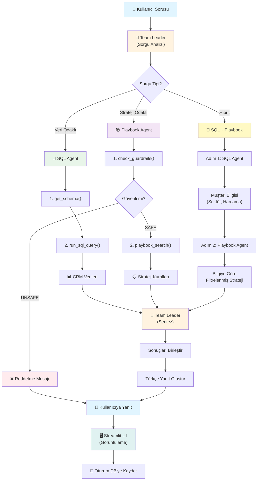

# AI Satış Asistanı 🤖

Satış ekipleri için geliştirilmiş, yapay zeka destekli akıllı satış asistanı. CRM veritabanı analizi ve satış playbook stratejilerini birleştirerek, satış temsilcilerine veriye dayalı ve şirket politikalarına uygun öneriler sunar.

[](https://www.youtube.com/watch?v=BTnyGb4LKP0)

## 📋 İçindekiler

- [Özellikler](#-özellikler)
- [Agentic Mimari](#-agentic-mimari)
- [Kod Akışı](#-kod-akışı)
- [Sistem Akış Diagramı](#-sistem-akış-diagramı)
- [Kurulum](#-kurulum)
  - [Docker ile Kurulum](#-docker-ile-kurulum-önerilen)
- [Kullanım](#-kullanım)
- [Agent Tool Yetenekleri](#-agent-tool-yetenekleri)
- [Metadata Filter Özellikleri](#-metadata-filter-özellikleri)
- [Playbook Yapısı](#-playbook-yapısı)
- [Proje Yapısı](#-proje-yapısı)
- [Teknoloji Stack](#-teknoloji-stack)

## 🚀 Özellikler

- **Multi-Agent Mimari**: Uzmanlaşmış ajanlar (SQL Agent, Playbook Agent) ile koordineli çalışma
- **CRM Entegrasyonu**: SQLite tabanlı müşteri veritabanı sorgulama
- **Satış Playbook**: Vektör veritabanı ile anlamsal arama destekli strateji önerileri
- **Metadata Filter**: Sektör, kategori, bütçe eşiği gibi kriterlere göre gelişmiş filtreleme
- **Güvenlik Kontrolleri**: Guardrail sistemi ile güvenli ve politikalara uygun yanıtlar
- **Streamlit UI**: Modern ve kullanıcı dostu arayüz
- **Oturum Yönetimi**: Konuşma geçmişi ve bağlam koruma
- **Türkçe BERT**: Türkçe optimize edilmiş embedding modeli

## 🏗️ Agentic Mimari

Bu proje, **Agno 2.4.0** framework'ü kullanarak **multi-agent orchestration** pattern'i ile geliştirilmiştir. Sistem, uzmanlaşmış ajanların koordineli çalışmasıyla karmaşık satış sorgularını çözer.

### Agent Rolleri ve Sorumlulukları

#### 1. Team Leader (Koordinatör)
**Dosya**: [`agents/agent_leader.py`]

- **Görev**: Kullanıcı sorgularını analiz eder, görev dağıtımı yapar ve sonuçları sentezler
- **Model**: GPT-4o
- **Yetenekler**:
  - Sorgu tipini belirler (veri odaklı / strateji odaklı / hibrit)
  - Uygun ajanları seçer ve görevlendirir
  - Birden fazla ajandan gelen sonuçları birleştirir
  - Nihai yanıtı Türkçe ve profesyonel dilde oluşturur
- **Koordinasyon Stratejisi**:
  - **Veri Sorguları**: SQL Agent'ı çağırır
  - **Strateji Sorguları**: Playbook Agent'ı çağırır
  - **Hibrit Sorgular**: Önce SQL Agent'tan müşteri bilgisi alır, sonra bu bilgiyle Playbook Agent'tan strateji ister

#### 2. Guardrail Agent (Güvenlik Uzmanı)
**Dosya**: [`agents/agent_guardrial.py`]

- **Görev**: Kullanıcı sorgularının uçtan uca güvenli ve kurumsal politikalara uygun olup olmadığını denetler
- **Model**: GPT-4o
- **Tools**:
  - `check_guardrails(query)`: Sorgu bazlı güvenlik kontrolü
- **Kullanım Alanları**:
  - Prompt injection / jailbreak denemelerinin engellenmesi
  - Alakasız veya uygunsuz (satış dışı) konuların filtrelenmesi
  - Şirket politikalarına aykırı sorguların reddedilmesi

#### 3. SQL Agent (CRM Uzmanı)
**Dosya**: [`agents/agent_sql.py`]

- **Görev**: CRM veritabanına erişim ve veri analizi
- **Model**: GPT-4o
- **Veritabanı**: [`data/crm.db`] (SQLite)
- **Tools**:
  - `get_schema()`: Veritabanı şemasını döndürür
  - `run_sql_query(query)`: SELECT sorguları çalıştırır
- **Güvenlik**: Sadece SELECT sorguları izinli (INSERT/UPDATE/DELETE yasak)
- **Kullanım Alanları**:
  - Müşteri harcama analizleri
  - Sektör bazlı filtreleme
  - Son toplantı tarihi sorguları
  - Hesap yöneticisi bazlı raporlar

#### 4. Playbook Agent (Strateji Uzmanı)
**Dosya**: [`agents/agent_playbook.py`]

- **Görev**: Satış stratejileri ve güvenlik kontrolü
- **Model**: GPT-4o
- **Vektör DB**: ChromaDB + Turkish BERT embeddings
- **Playbook**: [`data/sales_playbook.json`] (10 kural)
- **Tools**:
  - `playbook_search(query_text, n_results, filter_dict)`: Anlamsal arama
- **Kullanım Alanları**:
  - Sektörel stratejiler
  - Bütçe bazlı ürün önerileri
  - İndirim politikaları
  - Compliance kuralları

### Oturum Yönetimi

- **Veritabanı**: [`data/agno_shared.db`] (SQLite)
- **Özellikler**:
  - Her kullanıcı için benzersiz session_id
  - Konuşma geçmişi saklanır
  - Bağlam korunur (add_history_to_context=True)
  - Tüm ajanlar aynı veritabanını paylaşır

### Vektör Veritabanı

**Processor**: [`data/processor.py`]

- **Teknoloji**: ChromaDB
- **Embedding Model**: `emrecan/bert-base-turkish-cased-mean-nli-stsb-tr`
- **Collection**: `sales_playbook`
- **Özellikler**:
  - Türkçe optimize edilmiş anlamsal arama
  - Metadata filtreleme desteği
  - Similarity score hesaplama
  - JSON formatında sonuç döndürme

## Kod Akışı

Kullanıcı sorgusundan yanıta kadar olan süreç şu adımlardan oluşur:

### 1. Kullanıcı Girişi
**Dosya**: [`app.py`]

```python
# Streamlit UI'dan kullanıcı sorusu alınır
prompt = st.chat_input("Bir soru sorun...")

# Team Leader'a gönderilir
response = team.run(
    prompt, 
    stream=True, 
    session_id=st.session_state.session_id
)
```

### 2. Team Leader Analizi
**Dosya**: [`agents/agent_leader.py`]

Team Leader sorguyu analiz eder ve şu kararları verir:

- **Sorgu Tipi Nedir?**
  - Veri odaklı → SQL Agent
  - Strateji odaklı → Playbook Agent
  - Hibrit → Her iki ajan

- **Hangi Bilgiler Gerekli?**
  - Müşteri bilgisi mi?
  - Sektör stratejisi mi?
  - Bütçe kuralları mı?

### 3. Guardrail Kontrolü (Her Zaman İlk Adım)
**Tool**: `check_guardrails(query)`

```python
# Playbook Agent güvenlik kontrolü yapar
result = check_guardrails("Coca Cola için strateji nedir?")
# Sonuç: "SAFE" veya "UNSAFE"
```

- **SAFE**: İşlem devam eder
- **UNSAFE**: Kullanıcıya kibarca reddedilir

### 4. SQL Agent İşlemleri (Gerekirse)
**Dosya**: [`agents/agent_sql.py`]

```python
# 1. Şemayı öğren
schema = get_schema()

# 2. SQL sorgusu oluştur ve çalıştır
query = "SELECT * FROM customers WHERE client_name = 'Coca Cola'"
result = run_sql_query(query)
# Sonuç: {"client_name": "Coca Cola", "industry": "FMCG", "total_spend_ytd": 450000, ...}
```

### 5. Playbook Agent İşlemleri (Gerekirse)
**Dosya**: [`agents/agent_playbook.py`]

```python
# Anlamsal arama + metadata filter
result = playbook_search(
    query_text="FMCG stratejisi",
    n_results=3,
    filter_dict={"industry_filter": "FMCG"}
)
# Sonuç: [{"rule_id": "RULE_001", "rule_text": "...", "similarity_score": 0.89}, ...]
```

### 6. Sonuç Sentezi
**Team Leader** tüm bilgileri birleştirir:

```
SQL Agent Sonucu: Coca Cola, FMCG sektörü, 450k harcama
Playbook Agent Sonucu: RULE_001 (FMCG için mağaza içi dijital ekran)
                       RULE_002 (150k+ için premium video)

Nihai Yanıt:
"Coca Cola, FMCG sektöründe faaliyet gösteriyor ve bu yıl 450k harcama yapmış.
RULE_001'e göre mağaza içi dijital ekran ağımızı öncelikli olarak sunmalısınız.
Ayrıca RULE_002 gereği, 150k üzeri harcama yaptığı için premium video reklamları
da önerebilirsiniz."
```

### 7. Yanıt Görüntüleme
**Dosya**: [`app.py`]

- Streamlit UI yanıtı streaming olarak gösterir
- Tool çağrıları "Ajan İşlemleri" expander'ında loglanır
- Konuşma geçmişine kaydedilir

### Hibrit Sorgu Örneği

**Kullanıcı**: "Coca Cola için bir sonraki toplantıda ne önermeliyim?"

```
1. Team Leader: Hibrit sorgu tespit edildi
2. Guardrail: SAFE ✓
3. SQL Agent: Coca Cola bilgilerini getir
   → Sonuç: FMCG, 450k harcama, son toplantı 30 gün önce
4. Playbook Agent: "FMCG sektörü 450k harcama için strateji"
   → Filter: {"industry_filter": "FMCG"}
   → Sonuç: RULE_001, RULE_002
5. Team Leader: Sentez ve yanıt oluştur
6. Streamlit: Kullanıcıya göster
```

## 📊 Sistem Akış Diagramı



### Diagram Açıklaması

- **Mavi**: Kullanıcı etkileşimi
- **Turuncu**: Team Leader (koordinasyon)
- **Yeşil**: SQL Agent (veri)
- **Mor**: Playbook Agent (strateji)
- **Sarı**: Hibrit akış
- **Kırmızı**: Hata/reddetme

## �📦 Kurulum

### Hızlı Kurulum (Önerilen)

```bash
# Windows için
make setup    # Virtual environment oluştur ve bağımlılıkları yükle
make run      # Uygulamayı başlat
```


## 💡 Kullanım

### Case Bazlı Örnek Sorgular

Sistem, farklı sorgu tiplerine göre otomatik olarak doğru ajanları seçer ve koordine eder.

#### 📊 Case 1: Sadece CRM Verisi (SQL Agent)

Bu sorgular sadece veritabanından bilgi çeker, strateji önerisi içermez.

```
1. "Coca Cola'nın bu yıl toplam harcaması ne kadar?"
   → SQL Agent: SELECT total_spend_ytd FROM customers WHERE client_name = 'Coca Cola'
   
2. "Finans sektöründeki tüm müşterilerimizi listele"
   → SQL Agent: SELECT client_name, total_spend_ytd FROM customers WHERE industry = 'Finance'
   
3. "Son 90 gün içinde görüşülmeyen müşteriler kimler?"
   → SQL Agent: SELECT client_name, last_meeting_date FROM customers WHERE ...
   
4. "İstanbul bölgesindeki büyük ölçekli şirketler hangileri?"
   → SQL Agent: SELECT * FROM customers WHERE region = 'Istanbul' AND company_size = 'Large'
```

**Beklenen Davranış**: Team Leader sadece SQL Agent'ı çağırır, sonucu kullanıcıya iletir.

#### 🎯 Case 2: Sadece Strateji (Playbook Agent)

Bu sorgular genel satış stratejileri, politikalar ve sektörel öneriler ister.

```
1. "FMCG sektörü için hangi kanalları önerirsin?"
   → Playbook Agent: playbook_search("FMCG kanal stratejisi", filter={"industry_filter": "FMCG"})
   → Sonuç: RULE_001 (Mağaza içi dijital ekran)
   
2. "150k altı bütçeli müşterilere ne önermeliyim?"
   → Playbook Agent: playbook_search("düşük bütçe", filter={"spend_threshold_max": 150000})
   → Sonuç: RULE_002 (Mobil uygulama afişleri)
   
3. "Finans sektöründe dikkat etmem gereken compliance kuralları neler?"
   → Playbook Agent: playbook_search("compliance", filter={"industry_filter": "Finance", "rule_category": "compliance"})
   → Sonuç: RULE_005 (Veri gizliliği politikaları)
   
4. "Premium müşterilere özel paketlerimiz var mı?"
   → Playbook Agent: playbook_search("premium paket", filter={"spend_threshold_min": 500000})
   → Sonuç: RULE_007 (VIP kampanya paketi)
```

**Beklenen Davranış**: Team Leader önce guardrail kontrolü yapar, sonra Playbook Agent'ı çağırır.

#### 🔄 Case 3: Hibrit (SQL + Playbook)

Bu sorgular hem müşteri bilgisi hem de o bilgiye özel strateji gerektirir. **En karmaşık ve en değerli senaryolar!**

```
1. "Coca Cola için bir sonraki toplantıda hangi ürünleri önermeliyim?"
   → Adım 1: SQL Agent → Coca Cola bilgisi (FMCG, 450k harcama)
   → Adım 2: Playbook Agent → "FMCG 450k harcama stratejisi" (filter: industry=FMCG)
   → Sentez: "RULE_001 ve RULE_002'ye göre mağaza içi ekran ve premium video önerin"
   
2. "500k harcaması olan FMCG müşterilerime özel paket var mı?"
   → Adım 1: SQL Agent → 500k+ FMCG müşterileri listesi
   → Adım 2: Playbook Agent → filter: {industry=FMCG, spend_min=500000}
   → Sentez: "RULE_007 VIP paketi + RULE_009 Omnichannel kampanya"
   
3. "Yeni kazandığımız Teknoloji sektörü müşterisi için strateji hazırla"
   → Adım 1: SQL Agent → Müşteri bilgilerini getir (harcama, büyüklük)
   → Adım 2: Playbook Agent → filter: {industry=Technology}
   → Sentez: Müşteriye özel strateji raporu
   
4. "Acme Corp'a indirim teklif etmeli miyim?"
   → Adım 1: SQL Agent → Acme Corp harcama bilgisi
   → Adım 2: Playbook Agent → İndirim politikası (pricing_policy)
   → Sentez: "RULE_010'a göre 100k altı müşterilere indirim yasak, bölge müdürü onayı gerekli"
```

**Beklenen Davranış**: Team Leader önce SQL Agent'tan veri alır, bu veriyi kullanarak Playbook Agent'a filtrelenmiş sorgu gönderir, sonuçları birleştirir.

#### ❌ Case 4: Kapsam Dışı Sorgular

```
1. "Python nasıl öğrenilir?"
   → Guardrail: UNSAFE
   → Yanıt: "Üzgünüm, bu konu satış asistanımın kapsamı dışında..."
   
2. "Hava durumu nasıl?"
   → Guardrail: UNSAFE
   → Yanıt: Kibarca reddedilir
```

**Beklenen Davranış**: Playbook Agent guardrail kontrolünde UNSAFE döner, Team Leader kullanıcıyı bilgilendirir.

## 🛠️ Agent Tool Yetenekleri

Her agent'ın özel araçları (tools) vardır. Bu araçlar, ajanların görevlerini yerine getirmesini sağlar.

### SQL Agent Tools

#### 1. `get_schema()`

CRM veritabanının şemasını döndürür. SQL sorgusu yazmadan önce **mutlaka** çağrılmalıdır.

**Input**: Yok

**Output**:
```json
{
  "table": "customers",
  "columns": [
    {"name": "client_id", "type": "TEXT", "description": "Müşteri ID"},
    {"name": "client_name", "type": "TEXT", "description": "Müşteri adı"},
    {"name": "industry", "type": "TEXT", "description": "Sektör"},
    {"name": "total_spend_ytd", "type": "INTEGER", "description": "Bu yılki toplam harcama"},
    {"name": "last_meeting_date", "type": "TEXT", "description": "Son toplantı tarihi"},
    {"name": "account_manager", "type": "TEXT", "description": "Hesap yöneticisi"},
    {"name": "region", "type": "TEXT", "description": "Bölge"},
    {"name": "company_size", "type": "TEXT", "description": "Şirket büyüklüğü"},
    {"name": "contract_value", "type": "INTEGER", "description": "Sözleşme değeri"},
    {"name": "contract_status", "type": "TEXT", "description": "Sözleşme durumu"},
    {"name": "products_used", "type": "TEXT", "description": "Kullanılan ürünler"}
  ]
}
```

**Kullanım**:
```python
schema = get_schema()
# Agent şemayı öğrenir ve doğru SQL sorgusu yazar
```

#### 2. `run_sql_query(query: str)`

CRM veritabanında SQL sorgusu çalıştırır.

**Input**:
- `query` (string): SELECT sorgusu
  - ✅ İzinli: `SELECT * FROM customers WHERE industry = 'FMCG'`
  - ❌ Yasak: `UPDATE`, `DELETE`, `INSERT`, `DROP`

**Output**:
```json
[
  {
    "client_id": "C001",
    "client_name": "Coca Cola",
    "industry": "FMCG",
    "total_spend_ytd": 450000,
    "last_meeting_date": "2026-01-15",
    "account_manager": "Ahmet Yılmaz",
    "region": "Istanbul",
    "company_size": "Large",
    "contract_value": 500000,
    "contract_status": "Active",
    "products_used": "Digital Display, Mobile Ads"
  }
]
```

**Hata Durumu**:
```json
{"error": "Sadece SELECT sorguları desteklenir"}
```

**Güvenlik Özellikleri**:
- Sadece SELECT sorguları çalıştırılabilir
- SQL injection koruması
- Read-only erişim

### Playbook Agent Tools

#### 1. `playbook_search(query_text: str, n_results: int = 1, filter_dict: dict = None)`

Satış playbook'unda anlamsal arama yapar ve metadata filtreleri uygular.

**Input Parametreleri**:

| Parametre | Tip | Zorunlu | Varsayılan | Açıklama |
|-----------|-----|---------|------------|----------|
| `query_text` | string | ✅ | - | Aranacak doğal dil sorgusu |
| `n_results` | integer | ❌ | 1 | Döndürülecek sonuç sayısı |
| `filter_dict` | dict | ❌ | None | Metadata filtreleri |

**Filter Dict Seçenekleri**:

| Filter Key | Tip | Örnek Değerler | Açıklama |
|------------|-----|----------------|----------|
| `rule_category` | string | `channel_strategy`, `budget_threshold`, `product_recommendation`, `pricing_policy`, `compliance` | Kural kategorisi |
| `industry_filter` | string | `FMCG`, `Finance`, `Healthcare`, `Electronics`, `Technology`, `All` | Sektör filtresi |
| `priority_level` | string | `high`, `medium`, `critical` | Öncelik seviyesi |
| `action_type` | string | `recommend`, `require_approval`, `mandatory`, `avoid` | Aksiyon tipi |
| `approval_required` | string | `True`, `False` | Onay gereksinimi |
| `spend_threshold_min` | integer | `0`, `150000`, `500000` | Minimum harcama eşiği |
| `spend_threshold_max` | integer | `100000`, `150000`, `500000` | Maximum harcama eşiği |

**Kullanım Örnekleri**:

```python
# Örnek 1: Basit arama (filter yok)
playbook_search(
    query_text="FMCG stratejisi",
    n_results=3
)

# Örnek 2: Sektör filtresi
playbook_search(
    query_text="kanal önerileri",
    n_results=5,
    filter_dict={"industry_filter": "FMCG"}
)

# Örnek 3: Bütçe eşiği filtresi
playbook_search(
    query_text="ürün önerileri",
    filter_dict={
        "spend_threshold_min": 150000,
        "rule_category": "product_recommendation"
    }
)

# Örnek 4: Çoklu filter
playbook_search(
    query_text="compliance kuralları",
    filter_dict={
        "industry_filter": "Finance",
        "rule_category": "compliance",
        "priority_level": "critical"
    }
)
```

**Output**:
```json
[
  {
    "rule_id": "RULE_001",
    "rule_category": "channel_strategy",
    "rule_text": "FMCG müşterileri için, marka görünürlüğünü artırmak amacıyla...",
    "priority_level": "high",
    "action_type": "recommend",
    "approval_required": false,
    "recommended_product": "In-Store Digital Display",
    "industry_filter": ["FMCG"],
    "similarity_score": 0.8945
  }
]
```

**Özellikler**:
- **Anlamsal Arama**: Turkish BERT ile Türkçe optimize edilmiş
- **Similarity Score**: 0-1 arası benzerlik skoru (1 = tam eşleşme)
- **Metadata Filter**: Çoklu filter kombinasyonu desteklenir
- **JSON Output**: LLM'ler için optimize edilmiş format

#### 2. `check_guardrails(query: str)`

Kullanıcı sorgusunun güvenli ve satış alanıyla ilgili olup olmadığını kontrol eder.

**Input**:
- `query` (string): Kontrol edilecek kullanıcı sorusu

**Output**:
- `"SAFE"`: Sorgu güvenli, işlem devam edebilir
- `"UNSAFE"`: Sorgu kapsam dışı veya riskli

**Güvenli Sorgular**:
```python
check_guardrails("Coca Cola için strateji nedir?")  # → SAFE
check_guardrails("CRM'deki müşterileri listele")    # → SAFE
check_guardrails("İndirim politikamız nedir?")      # → SAFE
```

**Güvensiz Sorgular**:
```python
check_guardrails("Python nasıl öğrenilir?")         # → UNSAFE
check_guardrails("Hava durumu nasıl?")              # → UNSAFE
```

**Kullanım Akışı**:
```python
# Her sorgu için ilk adım
result = check_guardrails(user_query)

if result == "SAFE":
    # Diğer tool'ları çağır
    playbook_search(...)
else:
    # Kullanıcıya kibarca reddet
    return "Üzgünüm, bu konu satış asistanımın kapsamı dışında..."
```

**Güvenlik Özellikleri**:
- Her sorgu için **zorunlu** ilk kontrol
- LLM tabanlı içerik analizi
- Satış alanı dışı konuları filtreler
- Zararlı içerik koruması

## 🎯 Metadata Filter Özellikleri

Sistem, playbook kurallarını **metadata filtreleri** ile hassas bir şekilde sorgulayabilir. Bu özellik, ajanların doğru stratejileri bulmasını sağlar.

### Kullanılabilir Metadata Alanları

| Alan | Tip | Açıklama | Örnek Değerler |
|------|-----|----------|----------------|
| `rule_category` | string | Kural kategorisi | `channel_strategy`, `budget_threshold`, `product_recommendation`, `pricing_policy`, `compliance` |
| `industry_filter` | string | Hedef sektör | `FMCG`, `Finance`, `Healthcare`, `Electronics`, `Technology`, `All` |
| `priority_level` | string | Öncelik seviyesi | `high`, `medium`, `critical` |
| `action_type` | string | Aksiyon tipi | `recommend`, `require_approval`, `mandatory`, `avoid` |
| `approval_required` | string | Onay gereksinimi | `True`, `False` |
| `spend_threshold_min` | integer | Minimum harcama | `0`, `150000`, `500000` |
| `spend_threshold_max` | integer | Maximum harcama | `100000`, `150000`, `500000` |
| `recommended_product` | string | Önerilen ürün | `In-Store Digital Display`, `Mobile App Banners` |

### Metadata Filter Kullanım Örnekleri

#### 1. Sektöre Göre Filtreleme

```python
# FMCG sektörü için tüm stratejileri getir
playbook_search(
    query_text="strateji önerileri",
    n_results=5,
    filter_dict={"industry_filter": "FMCG"}
)
```

**Sonuç**: Sadece FMCG sektörüne özel kurallar döner (RULE_001, RULE_009)

#### 2. Kategori Bazlı Filtreleme

```python
# Sadece bütçe eşiği kurallarını getir
playbook_search(
    query_text="müşteri bütçesi",
    n_results=3,
    filter_dict={"rule_category": "budget_threshold"}
)
```

**Sonuç**: `budget_threshold` kategorisindeki kurallar (RULE_002, RULE_007, RULE_010)

#### 3. Öncelik Seviyesine Göre Filtreleme

```python
# Sadece kritik öncelikli kuralları getir
playbook_search(
    query_text="önemli politikalar",
    n_results=10,
    filter_dict={"priority_level": "critical"}
)
```

**Sonuç**: `critical` öncelikli kurallar (RULE_003, RULE_005, RULE_007, RULE_008)

#### 4. Onay Gerektiren Kurallar

```python
# Onay gerektiren tüm kuralları listele
playbook_search(
    query_text="onay gerekli",
    n_results=10,
    filter_dict={"approval_required": "True"}
)
```

**Sonuç**: `approval_required: true` olan kurallar (RULE_003, RULE_005, RULE_010, RULE_014)

#### 5. Çoklu Filter Kombinasyonu

```python
# FMCG sektöründe yüksek öncelikli kanal stratejileri
playbook_search(
    query_text="dijital kanallar",
    n_results=3,
    filter_dict={
        "industry_filter": "FMCG",
        "rule_category": "channel_strategy",
        "priority_level": "high"
    }
)
```

**Sonuç**: Tüm kriterleri karşılayan kurallar (RULE_001)

### Gerçek Kullanım Senaryoları

#### Senaryo 1: Yeni FMCG Müşterisi

**Durum**: 80k harcama yapan yeni bir FMCG müşterisi

**Sorgu**:
```python
# 1. Sektöre özel stratejiler
playbook_search(
    query_text="FMCG müşteri stratejisi",
    filter_dict={"industry_filter": "FMCG"}
)

# 2. Düşük bütçe için öneriler
playbook_search(
    query_text="düşük bütçe önerileri",
    filter_dict={
        "rule_category": "budget_threshold",
        "spend_threshold_max": 150000
    }
)
```

**Dönen Kurallar**:
- RULE_001: FMCG için mağaza içi dijital ekran önerisi
- RULE_002: 150k altı için mobil uygulama afişleri

#### Senaryo 2: Finans Sektörü Compliance

**Durum**: Finans sektöründe yeni bir kampanya

**Sorgu**:
```python
playbook_search(
    query_text="finans sektörü uyumluluk",
    filter_dict={
        "industry_filter": "Finance",
        "rule_category": "compliance"
    }
)
```

**Dönen Kurallar**:
- RULE_005: Veri gizliliği ve uyumluluk politikaları (mandatory)

#### Senaryo 3: Premium Müşteri (500k+)

**Durum**: 600k harcama yapan stratejik müşteri

**Sorgu**:
```python
playbook_search(
    query_text="premium müşteri önerileri",
    filter_dict={
        "spend_threshold_min": 500000
    }
)
```

**Dönen Kurallar**:
- RULE_007: VIP kampanya paketleri ve dedicated hesap yöneticisi

## 📚 Playbook Yapısı

### Örnek Kural Yapısı

```json
{
  "rule_id": "RULE_001",
  "rule_category": "channel_strategy",
  "industry_filter": ["FMCG"],
  "spend_threshold_min": null,
  "spend_threshold_max": null,
  "recommended_product": "In-Store Digital Display",
  "priority_level": "high",
  "action_type": "recommend",
  "rule_text": "FMCG müşterileri için, marka görünürlüğünü artırmak amacıyla...",
  "approval_required": false
}
```

### Kural Kategorileri

| Kategori | Açıklama | Örnek Kurallar |
|----------|----------|----------------|
| `channel_strategy` | Kanal stratejileri ve önerileri | RULE_001, RULE_006 |
| `budget_threshold` | Bütçe bazlı öneriler | RULE_002, RULE_007, RULE_010 |
| `product_recommendation` | Ürün önerileri | RULE_004, RULE_009 |
| `pricing_policy` | Fiyatlandırma politikaları | RULE_003, RULE_010 |
| `compliance` | Uyumluluk ve yasal gereksinimler | RULE_005, RULE_008 |

### Action Type Açıklamaları

| Action Type | Anlamı | Kullanım |
|-------------|--------|----------|
| `recommend` | Öneri | Müşteriye sunulabilir |
| `require_approval` | Onay gerekli | Yönetici onayı alınmalı |
| `mandatory` | Zorunlu | Mutlaka uygulanmalı |
| `avoid` | Kaçınılmalı | Yapılmaması önerilir |

## 📁 Proje Yapısı

```
mgrs-agno/
│
├── app.py                      # Streamlit UI - Ana uygulama
├── Makefile                    # Make komutları
│
├── agents/                     # Ajan modülleri
│   ├── agent_leader.py        # Team Leader - Koordinatör
│   ├── agent_guardrial.py     # Guardrail Agent - Güvenlik
│   ├── agent_playbook.py      # Playbook Agent - Strateji
│   └── agent_sql.py           # SQL Agent - CRM veri
│
├── tools/                      # Yardımcı araçlar
│   └── utils.py               # LLM çağrıları
│
├── data/                       # Veri dosyaları
│   ├── crm.db                 # CRM veritabanı
│   ├── sales_playbook.json    # Satış stratejileri (10 kural)
│   ├── processor.py           # Vektör DB işlemcisi
│   └── agno_shared.db         # Oturum veritabanı
│
├── prompts/                    # Sistem promptları
│   └── prompt.py              # Ajan promptları
│
├── .env                        # API key
├── .gitignore                  # Git ignore
├── requirements.txt            # Python bağımlılıkları
└── README.md                   
```


### 🐳 Docker ile Kurulum

Docker ile kurulum, tüm bağımlılıkların izole bir ortamda çalışmasını sağlar ve en hızlı başlangıç yöntemidir.

#### Gereksinimler
- Docker Desktop (Windows/Mac) veya Docker Engine (Linux)
- Docker Compose

#### Hızlı Başlangıç

```bash
# 1. .env dosyasını oluşturun
cp .env.example .env
# Ardından .env dosyasında OPENAI_API_KEY'inizi ayarlayın

# 2. Docker container'ı başlatın
docker-compose up -d

# 3. Tarayıcıda açın
# http://localhost:8501
